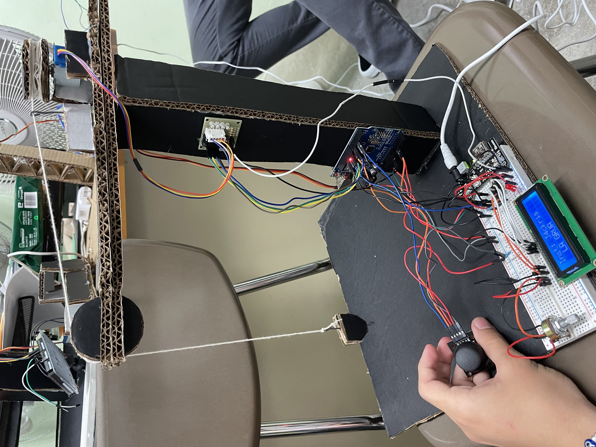
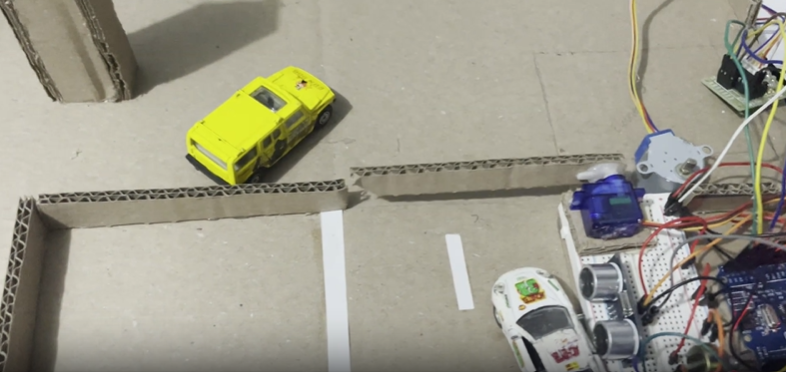
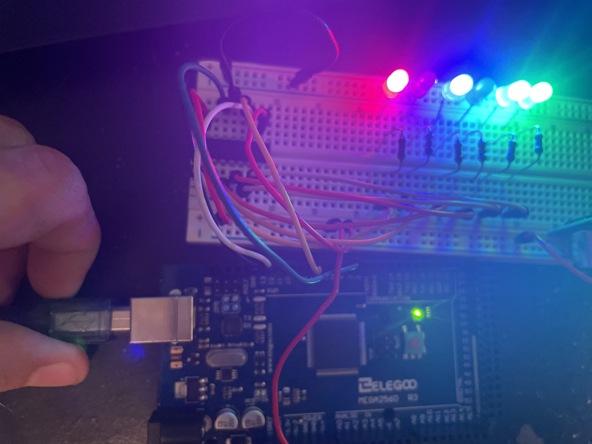

# Arduino Projects

## Crane
A simple Arduino-powered crane project that demonstrates motor control and lifting mechanisms.

### Components:
- Arduino board
- Servo motor / Stepper motor
- Motor driver (if needed)
- Power supply
- Joystick or buttons

### Description:
This project controls a small crane using motors and an Arduino. It can lift and rotate objects using a servo or stepper motor.

---

## Distance Medidor
An ultrasonic distance measurement project using an HC-SR04 sensor and an Arduino.

### Components:
- Arduino board
- HC-SR04 Ultrasonic sensor
- LCD Display / Serial monitor
- Jumper wires

### Description:
The sensor sends ultrasonic waves and calculates the distance by measuring the time taken for the waves to return.

---

## LCD Counter
A counter using an Arduino and an LCD display.

### Components:
- Arduino board
- 16x2 LCD Display
- Push buttons
- Resistors

### Description:
This project increments and decrements a counter displayed on the LCD using buttons.

---

## Parking Lot
A smart parking lot system using an Arduino.

### Components:
- Arduino board
- IR Sensors / Ultrasonic sensors
- Servo motor (for gate)
- LCD Display (optional)

### Description:
This system detects available parking spaces and can automate a gate using sensors.

[Project Video](img/parkinglot.mp4)

---

## Humidity Sensor
A humidity and temperature monitoring system using an Arduino and a DHT11/DHT22 sensor.

### Components:
- Arduino board
- DHT11/DHT22 Sensor
- LCD Display / Serial monitor

### Description:
This project measures humidity and temperature and displays the values on an LCD or serial monitor.

---

## Shift Register Demo
A demonstration of shift registers to expand output pins of an Arduino.

### Components:
- Arduino board
- 74HC595 Shift Register
- LEDs
- Resistors

### Description:
This project shows how to use a shift register to control multiple LEDs with fewer Arduino pins.

## Dinosaur Game
An Arduino-based version of the classic Google Chrome Dinosaur Game.

### Components:
- Arduino board
- OLED Display or LCD
- Push button
- Buzzer (optional for sound effects)

### Description:
This project replicates the popular Chrome Dinosaur Game on an Arduino. The player controls a dinosaur that jumps over obstacles by pressing a button. The game logic includes scoring and increasing difficulty over time.

### Features:
- Simple button-based controls
- Display score and obstacles
- Increasing difficulty over time

### How to Play:
Press the button to make the dinosaur jump and avoid obstacles. The game speed increases as you progress, making it more challenging!

